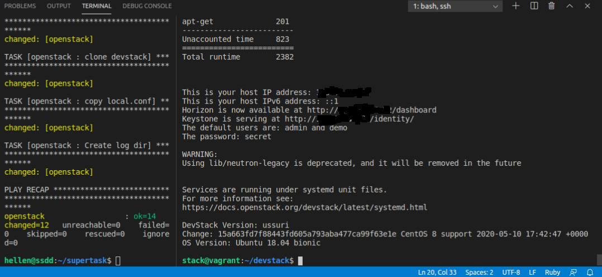

# ansible-vagrant-ansible-openstack

well it's painful way

1) ansible install vagrant on your machine
2) vagrant up box and provision with ansible playbooks
3) ansible plybooks install openstack

-- you are ~here --

4) ansible start nova_compute
5) ansible install on nova_compute wordpress
